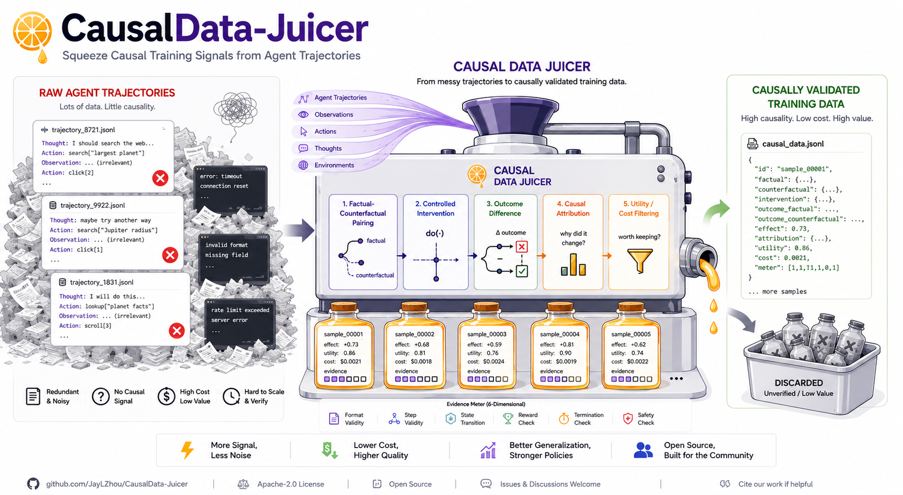

<div align="center">

# CausalData-Juicer

**Turn agent failures into training data that is *certified* to change outcomes.**

[](https://github.com/JayLZhou/CausalData-Juicer/actions/workflows/ci.yml)
[](LICENSE)
[](pyproject.toml)
[](tests/)

[English] | [[中文](README_ZH.md)] · [Docs](https://jaylzhou.github.io/CausalData-Juicer/) · [Operator Zoo](docs/operator-zoo.md) · [Claims ledger](experiments/claims.md)



</div>

Agent logs tell you what happened — never what *would have worked*. And
LLM-suggested fixes look right until you run them. CausalData-Juicer closes the
gap by **executing counterfactuals**: fork the exact state before a wrong step,
try a candidate fix for real, prove the control branch still reproduces the
failure, prove the fix flips the outcome — repeatedly — then compile the result
into trainer-ready data with an evidence tier on every row.

```python
episode, snapshots = collector.run_episode(task, workspace, policy)   # record
iv = Intervention(...)                                # a candidate fix, any source
unit = replayer.paired_replay(episode, snapshots, iv) # control + branch + n× repro
if unit.flipped:
    export(unit)          # -> SFT / DPO / PRM / memory / regression / TRL / verl
```

## 🚀 Try it in two minutes

```bash
git clone https://github.com/JayLZhou/CausalData-Juicer.git && cd CausalData-Juicer
python3 -m venv .venv && .venv/bin/pip install -e .
.venv/bin/cdj demo && .venv/bin/cdj explain runs/demo    # offline, no GPU, ~30s
```

Then pick your entry point:

| You have | Command | You get |
|---|---|---|
| nothing yet | `cdj demo` | the whole loop, offline, with a kill-line report |
| agent logs (JSONL) | `cdj import-trace traces.jsonl` | observational views, evidence ceiling enforced |
| a repo + a check | `cdj run --repo . --verify "pytest -q"` | certified correction pairs + an HTML report of what changed and why it counts |
| a DJ habit | `cdj process --config recipes/demo.yaml` | the same loop as a YAML operator recipe |

**39 operators** ship registered and recipe-usable (`cdj ops`) across the four
categories of the algebra — observational, source, interventional, compile.
We deliberately do not mirror Data-Juicer's 200+ text-cleaning operators:
those answer an observational question ("is this sample good?"), while every
operator here answers an interventional one ("would the outcome have
changed?"). The count in [the zoo](docs/operator-zoo.md) is generated from the
registry, and a test fails if the docs and the package ever disagree.
`recipes/attribution.yaml` chains fourteen of them into one offline run, and
`recipes/cda.yaml` runs the identify → generate → filter → validate mainline
where model-written branches earn `CONSTRAINT_VALIDATED` and **only executed
paired replay** can take them higher.

Don't trust us: **`cdj verify-claims`** re-earns the offline-verifiable core
on your machine — fresh demo collection, flip re-validation, negative
controls, exported-counterfactual replay, and a committed pack of a live run
replayed byte-for-byte with no model. It prints a PASS/FAIL/SKIP scorecard
and names what it *cannot* re-run offline (the GPU-hour-scale sweeps), whose
evidence ships as run directories in `experiments/results/` instead.

## 📊 Highlights (all pre-registered in the [claims ledger](experiments/claims.md))

- Flip decisions reproduce at **100% across 13 configurations** — guarded by CI
  negative controls that *reject* flaky environments.
- **102 validated units** mined from a doubly-certified 52-task migration bench
  at ~3s and $0 each; selective revalidation under real dependency events is
  **4.8–8.0×** cheaper with zero missed demotions.
- Six published data-construction strategies reproduced in **43–85 lines** each
  — including a June-2026 paper same-day, and MAS message-level credit via
  reactive replay ([showcase](docs/cases.md)).
- Honest nulls on the front page: our training-value pilot tied exactly, twice.
  It's in the ledger with re-test conditions.

## 📣 News

- **[2026-08-02]** Reactive paired replay: downstream agents re-react to intervened messages — MAS message credit becomes executable (case #7).
- **[2026-08-02]** Corpus 102 validated units; largest batch 207/207 flip reproduction.
- **[2026-08-01]** CAPER (June 2026) reproduced same-day, 77 lines, both directions.

## 📚 Learn more

[Why causal data](docs/why-causal-data.md) — the landscape, with 29 verified references ·
[Concepts](docs/concepts.md) — five objects, the evidence ladder, the four-question fit test ·
[Tutorial](docs/tutorial.md) — first causal unit in ten minutes ·
[The full story](docs/story-migration.md) · [Operator Zoo](docs/operator-zoo.md) ·
[Integrations](docs/integrations.md) (TRL / verl / DJ) · [FAQ](docs/faq.md) ·
[中文项目合同](README_ZH.md)

## ⚖️ License & citation

Apache-2.0.

```bibtex
@misc{causaldatajuicer2026,
  title  = {CausalData-Juicer: A Budgeted Interventional Data Engine for Agent Improvement},
  author = {Zhou, Yingli},
  year   = {2026},
  url    = {https://github.com/JayLZhou/CausalData-Juicer}
}
```

The name nods to [Data-Juicer](https://github.com/modelscope/data-juicer):
they refine the data you already have; we run the executions that create the
data you're missing.
